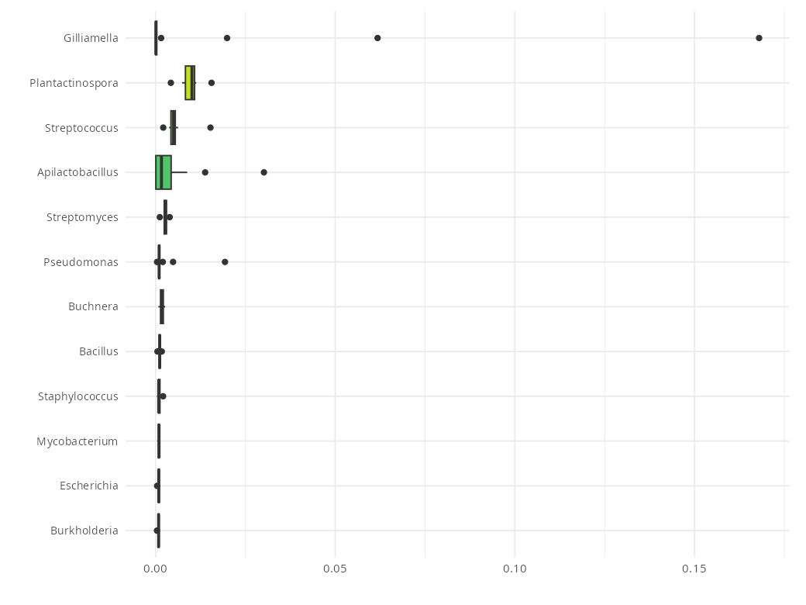

# aRchiteutis 

[](https://github.com/dsmutin/aRchiteutis/actions/workflows/R-CMD-check.yaml)
[](https://github.com/dsmutin/aRchiteutis)
[](LICENSE)

R package for Kraken2, Kaiju and Bracken reports: read them into a tidy table, or start from an abundance matrix, a phyloseq object, or a table exported from Python, then plot composition, diversity and ordination.

## Install

```r
# install.packages("remotes")
remotes::install_github("dsmutin/aRchiteutis")
library(aRchiteutis)
```

## Load data

Kraken2 reports (example files ship in the package):

```r
path   <- system.file("extdata", package = "aRchiteutis")
legend <- system.file("extdata", "legend.csv", package = "aRchiteutis")
df <- get_counts(path, pattern = "decont_b", legend = legend, trim_char = "_")
```

Other inputs, same plotting functions:

```r
df <- from_abundance(count_matrix, clade = "G")   # taxa in rows, samples in columns
df <- from_phyloseq(physeq, taxa_rank = "Genus")
df <- python2r("abundance.csv", clade = "G")      # CSV from inst/python/python2r.py
```

The table is long: `taxa`, `clade`, `sample`, `N`, `amount`, `amount_cl`, plus legend columns. `df_untidy()` turns it into a taxa-by-sample matrix. Trim with `df_taxa_trim()` or `df_get_top_taxa()` before plotting. Argument details and a second copy of every figure are in [vignettes.md](vignettes.md).

## Plots

Figures below are rendered from the bundled honey-bee brood reports.

### Composition

`df2donut()` — mean composition.


`df2composition()` — stacked bars per sample.


`df2barplot()` — amount per taxon.



### Diversity

`df2alpha_summary()` — alpha-diversity indices. `split_by` is a legend column (here, brood stage).


`df2beta()` — Bray–Curtis distances between samples. Point colour is brood stage.


`df2beta_pcoa()` — PCoA of that distance, with group ellipses.


### Clustering and correlation

`df2cluster()` — dendrogram of taxa or of samples. Leaf colour is the cluster.


`df2clust2d()` — mean abundance in two groups on a log10 scale (pupa vs larvae).


`df2heatmap()` — taxa by sample.


`df2corrplot()` — correlations between taxa.


### Ordination and group differences

`df2chord()` — circular co-occurrence graph.


`df2tsne()` — t-SNE of taxa.


`df2volcano()` — log abundance change between two legend groups.


`df2pca_sample()` — PCA of samples. `df2pca_sp()` — PCA of taxa.


## Cite

```r
citation("aRchiteutis")
```

The record lives in [`inst/CITATION`](inst/CITATION): Smutin, Taldaev, Lebedev & Adonin, *International Journal of Molecular Sciences* 25(2):741, 2024. <https://doi.org/10.3390/ijms25020741>
