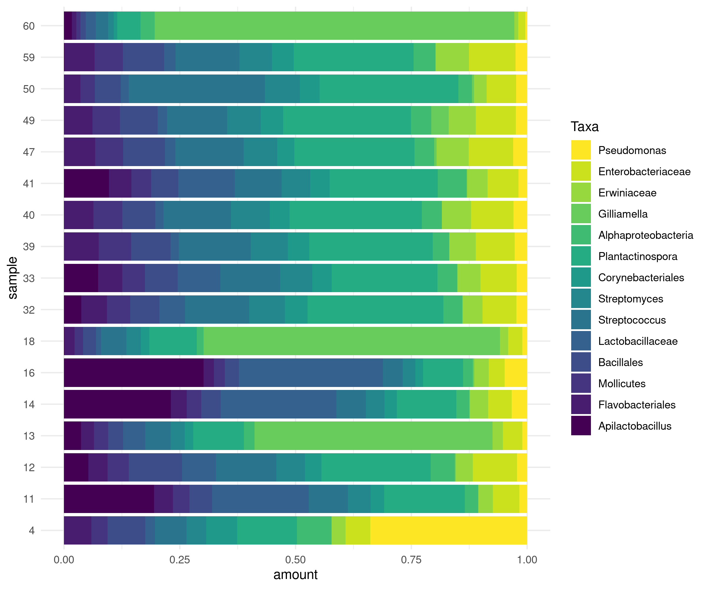
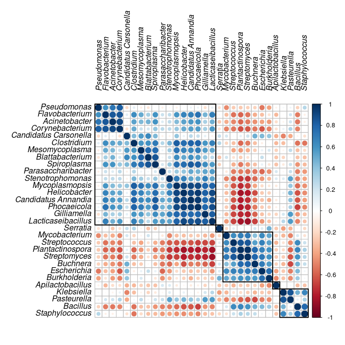

# aRchiteutis <a href=""></a> 
### tool for visualize &amp; work with Kraken2 reports

## Installation

To get the tool clone the git repository:
```bash
git clone https://github.com/dsmutin/samovar.git
```

In your R session, source all functions:
```R
source(PATH/TO/SAMOVAR/scripts/source.R)
```

## Structure

Functions for data preparation and their descriptions are avialable in /functions
Manipulations to visualize data is avialable in /plots
Test pipeline via /test repositorium

Enjoy beauty of R plots!


## Documentation

## Data manipulation
#### get_counts
get conut and amount table from kraken2 report

```
      path, #path to k2 reports
      keep_unclassified = T, #keep or not unclassified reads from report as new taxa
      pattern = "", #optional: pattern of file names to use
      trim_char = F, #optional: character to split file name in final table
      clade = F, #optional: which clade (like "O", "F", "G", "S" to use)
      type = k2, #character, kraken2 or kaiju
      legend = F #optional: path to legend file in csv format: 
                 #legend$name == name of kraken report (OR slited file name!), rest of columns - legend itself
  
  result is data.frame with columns: 
  
          #taxa, 
          #clade, 
          #sample, 
          #number of reads, 
          #ammount of all reads, 
          #amount of classified reads 
          #and several columns of applied legend
```

#### df_untidy
get untidy table for base::heatmap or future processing

```
      df, #result tibble from get_counts.R
      counts = T, #use counts or amount data
      classified_only = F, #only if counts = F, get amount by classified data
      drop_unclassified = F, #drop all unclasified levels
      keep_sample_name = F #warning! if T translate legend to separated format in name of each column :(
```

#### df_taxa_trim
trim taxa by their amount

```
      df, #result tibble from get_counts.R
      top_taxa = 10 #how many taxa to trim
      #attention! function remove all [taxa]*, keep only "S" and similar taxa
```

#### df_get_top_taxa
get top taxa from result data frame of different clade

```
      df, #result tibble from get_counts.R
      clade, #clade
      top, #count of top taxa to use
```

#### df_tidy_drop_unclassified
rop all unclassified tables

```
      df, #result tibble from get_counts.R
```

#### df_rescale
rescale all amounts to 1. neccessary if you drop some taxa levels

```
      df, #result tibble from get_counts.R
```

#### df_get_parents
get parents taxas to df

```
      df, #result tibble from get_counts.R
```
      
#### df_drop_clade
additional function to get all unclassified level down

```
      df, #result tibble from get_counts.R
```

## Execute plots

### Diversity calculation
#### df2alpha_summary
Calculate all alpha-diversity metrix. To use only part of them, use df2alpha


#### df2beta
Calculate all beta-diversity matrix


#### df2beta_pcoa
Calculate PCA based on beta-diversity matrix
(image below based on another dataset)


### Composition plots

#### df2donut
donut plot of the composition


#### df2composition
bar plot of the composition


#### df2barplot
box plot of the composition


#### df2cluster
cluster plot. untidy table input


#### df2clust2d
now depricated
2D cluser visualisation using legend. untidy table input


#### df2heatmap
heatmap plot. untidy table input


#### df2corrplot
corrplot. untidy table input. scaling required


#### df2chord
ggraph and circlize connection plot
#

#### df2tsne
tsne plot. untidy table input
#

#### df2volcano
volcano plot based on log amount change between groups
(image below based on another dataset)
#

#### df2pca_sample
pca plot for samples. untidy table input
#

#### df2pca_sp
pca plot for taxa. untidy table input


```
# Diversity:
df2alpha(df, split_by = F, add_legend = F, ...)
df2alpha_summary(df, split_by = F, add_legend = F,
alpha_function_list = list("Shannon" = shannon, "Simpson" = simpson), ...)

df2beta <- function(df, clade = F, dist_function = bray_curtis,
                    treshhold_up = 1,treshhold_down = 0,
                    add_legend = F, add_labels= F, print_df = F,
                    heatmap_type = "heatmap", ...)
df2beta_pcoa <- function(df,
                         dist_function = bray_curtis,
                         treshhold_up = 1, treshhold_down = 0,
                         add_legend = F, add_ellipse = F,...)

# Basic view:
df2donut(df, ...)           #ggplot2 donut plot
df2composition(df, ...)     #ggplot2 bar plot
df2barplot(df, ...)         #ggplot2 box plot. c:

# Interspecies crosstalk
df2cluster(df, k_means = 2, use = "sp", ...)                            #base R cluster plot
df2clust2d(dfU, legend_detect, clade = F, k_means = 5, counts = F, ...) #2D cluser visualisation using legend
df2heatmap(dfU,clade, trim = F, counts = F, ...)                        #base R heatmap plot
df2corrplot(df, clade = F, counts = F, ...)                             #corrplot. using scale
df2chord(df, clade = F, k_means = 5, counts = F,
         coenf_level = F, coenf, line_as_clusters = F, ...)             #ggraph and circlize connection plot
df2tsne(df, clade_trim, clade_color = "P", counts = T,
           taxa = NA, trim_taxa = T, only_input_taxa = F)               #ggplot2 tsne plot
df2pca_sample(df, clade = F, scale = T, ...)                            #factoextra pca plot for samples
df2pca_sp    (df, clade = F, scale = T, ...)                            #factoextra pca plot for taxa
```

#### Parameters  for all plotting functions
```
    df  - data.frame in format above
    dfU - data.frame after df_untidy transformation. numeric matrix with samples in column and species in row names

    split_by: column number to split the plot
    add_legend: column number(s) to add color legend
    add_label: column number(s) to add label legend
    add_ellipse: column number(s) to add ellipse legend
    treshhold_up: remove all values above the level from df
    treshhold_down: remove all values below the level from df
    dist_function: function to calculate diversity measure. one from abdiv package
    print_df: return data.frame insted of plot
    
    clade: character. which clade to use(e.g. "S", "G", "F")
    clade_color: character. which clade to usefor coloring (e.g. "S", "G", "F")
    drop_unclassified: logical. drop unclassified
    counts: logical. use counts or amount
    k_means: numeric. number of k-means to use
    use: character. one of "sp" and "sample"
    legend_detect: character. what to detect in legend to divied by two groups
    coenf_level: logical or numeric. trim connections according to level
    coenf: character. one of "upper", "lower" or "both" to trim in coenf_level
    only_input_taxa: logical. use or not only inputed taxa for labels
    taxa: character. what taxa to show on labels
    trim_taxa: logical. get only 1 word from the taxa to label. better use for species
    scale: logical. scale or not the data to get z-scores
```

## Citation
To cite the tool, please use
```
Smutin D, Taldaev A, Lebedev E, Adonin L. Shotgun Metagenomics Reveals Minor Micro“bee”omes Diversity Defining Differences between Larvae and Pupae Brood Combs. International Journal of Molecular Sciences. 2024; 25(2):741. https://doi.org/10.3390/ijms25020741 
```

or import BibText:
```
@Article{ijms25020741,
      AUTHOR = {Smutin, Daniil and Taldaev, Amir and Lebedev, Egor and Adonin, Leonid},
      TITLE = {Shotgun Metagenomics Reveals Minor Micro&ldquo;bee&rdquo;omes Diversity Defining Differences between Larvae and Pupae Brood Combs},
      JOURNAL = {International Journal of Molecular Sciences},
      VOLUME = {25},
      YEAR = {2024},
      NUMBER = {2},
      ARTICLE-NUMBER = {741},
      URL = {https://www.mdpi.com/1422-0067/25/2/741},
      PubMedID = {38255816},
      ISSN = {1422-0067},
      DOI = {10.3390/ijms25020741}
}
```

## References

Work on libraries: 
  - tidyverse
  - ggrepel
  - viridis
  - corrplot
  - ggraph
  - igraph
  - circlize
  - factoextra
  - Rtsne
