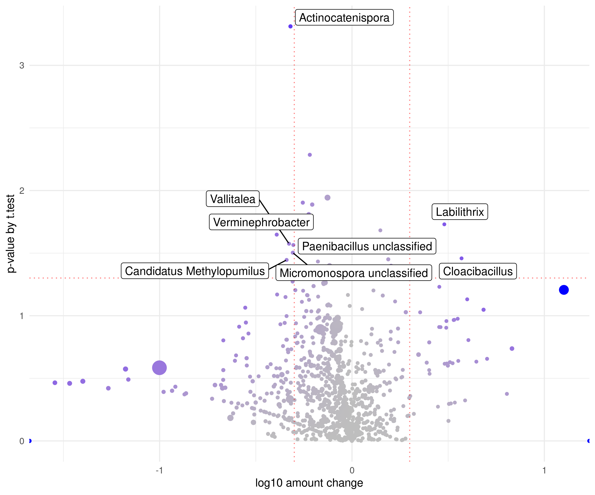

# aRchiteutis visualizations

Every `df2*` plot in the package, rendered on the bundled honey-bee brood
Kraken2 reports (`inst/extdata`). Copy the snippets, then swap in your own
tidy table from `get_counts()`, `from_abundance()`, `from_phyloseq()`, or
`python2r()`.

```r
library(aRchiteutis)

path   <- system.file("extdata", package = "aRchiteutis")
legend <- system.file("extdata", "legend.csv", package = "aRchiteutis")
df <- get_counts(path = path, pattern = "decont_b", legend = legend,
                 trim_char = "_")

df_nosp <- df[df$clade != "S", ]
dfT <- df_taxa_trim(df_nosp, top_taxa = 15)
dfC <- df_get_top_taxa(df, clade = "G", top = 50)
matG <- df_untidy(df, clade = "G", top = 30, scale = "scale")
```

---

## Composition

### `df2donut` — mean composition as a donut

```r
df2donut(dfT)
```


### `df2composition` — stacked bars per sample

```r
df2composition(dfT)
```


### `df2barplot` — per-taxon amount as a box plot

```r
df2barplot(dfC)
```


---

## Diversity

### `df2alpha_summary` — alpha-diversity metrics

```r
df2alpha_summary(df[df$clade == "S", ], split_by = 7, add_legend = 7:8)
```


### `df2beta` — beta-diversity heatmap

```r
df2beta(df, clade = "G", add_legend = 7:8)
```


### `df2beta_pcoa` — PCoA of the beta-diversity matrix

```r
df2beta_pcoa(df[df$clade == "G", ], add_legend = 7, add_ellipse = 7)
```


---

## Clustering and heatmaps

### `df2cluster` — hierarchical clustering of taxa or samples

```r
df2cluster(matG, k_means = 10, use = "sp")
```


### `df2clust2d` — 2-D cluster view coloured by legend

```r
df2clust2d(df[df$clade == "G", ], legend_detect = "pupa", top = 40, k_means = 10)
```


### `df2heatmap` — taxa-by-sample heatmap

```r
df2heatmap(df_untidy(df, clade = "G", top = 10), scale = "row", Colv = NA)
```


### `df2corrplot` — taxon–taxon correlation

```r
df2corrplot(matG, k_means = 5)
```


---

## Networks and ordination

### `df2chord` — co-occurrence chord / graph

```r
df2chord(matG, k_means = 10, coenf_level = 0.7)
```


### `df2tsne` — t-SNE of taxa

```r
df2tsne(matG, k_means = 10, text_top = 20)
```


### `df2volcano` — ANCOM-BC2 log fold change

The first `legend_detect` pattern is the reference group. Requires the optional packages ANCOMBC and phyloseq.

```r
df2volcano(df[df$clade == "G", ], legend_detect = c("larvae", "pupa"))
```



### `df2pca_sample` — PCA of samples

```r
df2pca_sample(
  df_untidy(df, clade = "S", scale = "scale", keep_sample_name = FALSE),
  scale = FALSE, detect = "pupa")
```


### `df2pca_sp` — PCA of taxa

```r
df2pca_sp(df_untidy(df, clade = "G", top = 10), scale = TRUE)
```


---

## Shared plot arguments

| Argument | Meaning |
| --- | --- |
| `df` | Long table from `get_counts()` / `from_abundance()` / `from_phyloseq()` / `python2r()` |
| `df` / `mat` (untidy) | Taxa-by-sample numeric matrix from `df_untidy()` |
| `split_by` | Legend column number used to facet |
| `add_legend` / `add_label` / `add_ellipse` | Legend column number(s) for colour / labels / ellipses |
| `clade` | Rank to keep (`"S"`, `"G"`, `"F"`, …) |
| `counts` | Use read counts (`N`) instead of relative `amount` |
| `k_means` | Number of k-means clusters |
| `treshhold_up` / `treshhold_down` | Drop values above / below a cutoff |
| `scale` | `"log2"`, `"scale"`, or `TRUE`/`FALSE` depending on the function |
